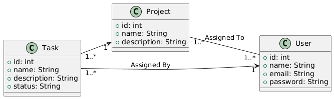

# Project Management App

## Overview

The Project Management App is a fullstack web application. The application ensures security using JWT tokens and implements recommended practices in REST API design. The backend is built with Spring Boot and Spring Security, while the frontend is developed using Angular.

## Features

- User registration and authentication.
- Project management: create, read, update, delete projects. Set project status (pending, in progress, completed).
- Tasks management.

**Class diagram**



<details>
  <summary>Diagram code for planttext.com</summary>

```
@startuml
left to right direction

class Task {
    +id: int
    +name: String
    +description: String
    +status: String
}

class Project {
    +id: int
    +name: String
    +description: String
}

class User {
    +id: int
    +name: String
    +email: String
    +password: String
}

' Many-to-one relationship between Task and Project
Task "1..*" --> "1" Project

' Many-to-many relationship between Project and User
Project "1..*" -- "1..*" User : Assigned To

' One-to-many relationship between Task and User
User "1" <-- "1..*" Task : Assigned By
@enduml
```

</details>

## Technologies Used

### Backend

- Spring Boot
- Spring Security
- OpenAPI and Swagger UI Documentation
- Docker

### Frontend

- Angular
- Bootstrap

## Setup Instructions

To setup the project, follow the instructions in each repository:

- [Backend repository](https://github.com/luisespinozadev/project-management-app-api)
- [Frontend repository](https://github.com/luisespinozadev/project-management-app-web)

## Contributors

- [Luis Espinoza](https://luisespinoza.dev)